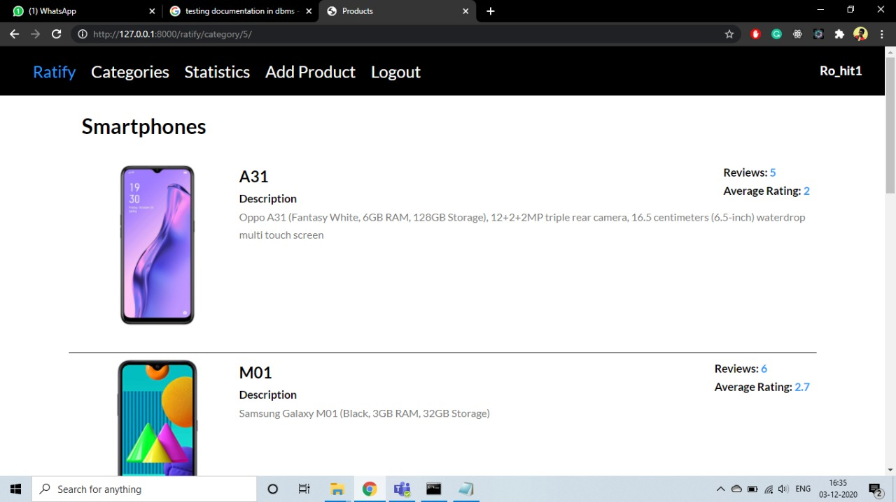

# Ratify

# Steps to run the project:

1. To install pip: sudo apt install python3-pip (ubuntu)
2. To install virtualenv: pip install virtualenv
3. To start virtualenv: virtualenv env
4. To activate virtualenv: source env/bin/activate
5. To deactivate virtualenv: deactivate
6. To install requirements and run project:
7. Create database i mysql with name 'ratify' and and write your database user and password in setting.py file
   i). Activate virtualenv
   ii). To install dependencies required pip install -r requirements.txt
   iii). Run python manage.py makemigrations
   iv). Run python manage.py migrate to make migrations
   v). Add a few queries in the database to see functioning
   vi). To run: python manage.py runserver

## Few Screenshots:

### 1.

### 2.

### 3.

### 4.

### 5.

### 6.

### 7.

